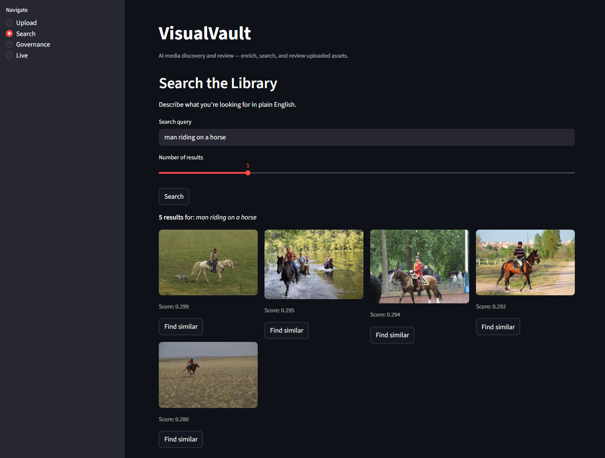
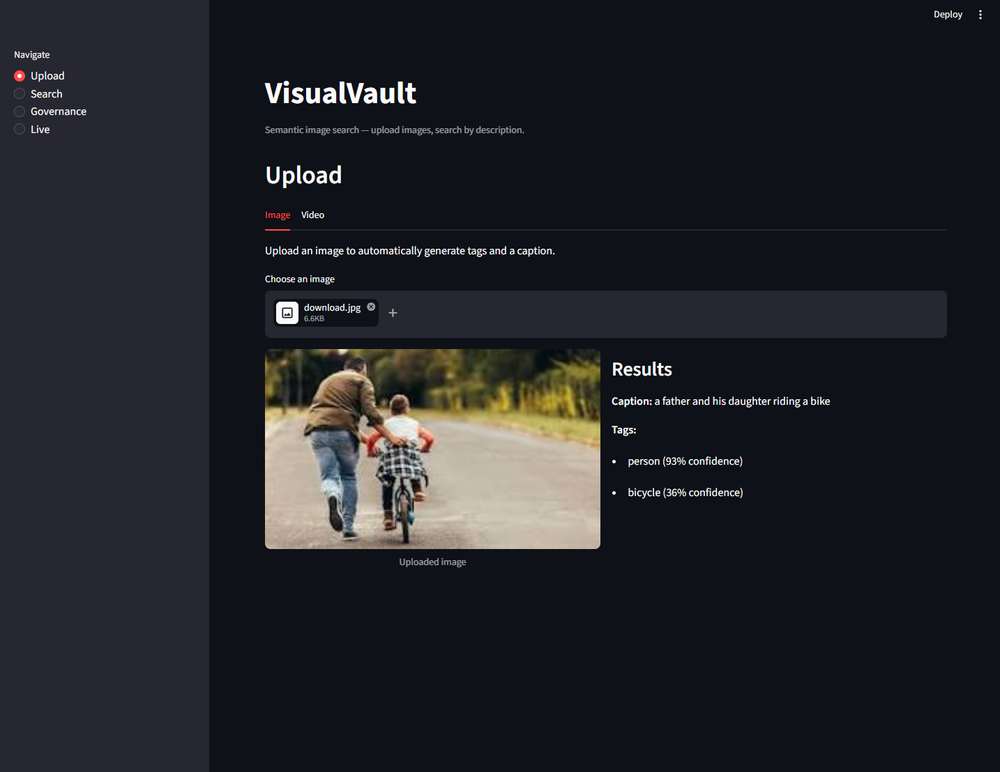
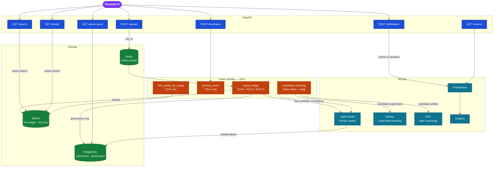

# VisualVault

**AI media discovery and review for a small creative team.**

Semantic search · asynchronous image/video enrichment · similarity search · review workflows

[](https://huggingface.co/spaces/kstha/visualvault-demo) [](https://github.com/stharajkiran/VisualVault/actions/workflows/ci.yml)

---

## What it does

VisualVault helps a small creative team make its image and video library easier to find and review. Upload media once; a background worker creates CLIP search embeddings, YOLO object tags, and optional BLIP-2 captions. Team members can search in plain English, find visually similar assets, and inspect media that needs metadata follow-up.

The project is a portfolio-scale AI media search and intake service, not a full enterprise digital asset management system. Its primary workflows are **Search**, **Ingest**, and **Review**. Its scope and intentional deferrals are stated below.

---

## Screenshots


_Natural language search — returns ranked results from 4,000 indexed images_


_Upload flow — YOLO object tags, BLIP-2 caption, and confidence scores returned per image_

---

## Measured results and scope

These are recorded local benchmarks from May 2026 on an RTX 5090 development machine. They are not service-level guarantees.

| Metric                    | Value              | Notes                                    |
| ------------------------- | ------------------ | ---------------------------------------- |
| Recall@10 (CLIP ViT-B/32) | **0.94**           | 200 GPT-4o-mini-generated queries; correct asset is in the 4k indexed COCO corpus |
| Indexing throughput       | **55 img/s**       | CLIP embedding plus Qdrant upsert during bulk indexing |
| Batch ingestion           | **88 img/min**     | Celery pipeline on one Windows solo worker, 50-image batch |
| TensorRT speedup          | **3.8×**           | CLIP image-encoder inference p50: 0.94ms vs 3.58ms; CPU preprocessing still dominates single-image end-to-end time |
| Video processing          | **230× real-time** | FFmpeg keyframe extraction benchmark: 0.26s per minute of synthetic footage |
| YOLO precision (holdout)  | **86.1%**          | 200 held-out COCO images; class-presence metric at confidence >= 0.25 |
| YOLO recall (holdout)     | **78.1%**          | Same held-out class-presence evaluation |
| YOLO F1 (holdout)         | **81.9%**          | Harmonic mean of the reported class-presence precision and recall |
| OOD drift score           | **0.339**          | 10-image OOD batch compared with the indexed COCO embedding baseline; alert threshold 0.15 |

The previously recorded 15ms search p95 is intentionally omitted from the public table because its benchmark is not yet a supported, reproducible evaluation command.

| Measurement | Reproduction command |
| --- | --- |
| Retrieval Recall@10 | `uv run python scripts/eval/eval_recall.py` |
| Bulk indexing throughput | `uv run python scripts/data/index_images.py` |
| Batch-ingestion throughput | `uv run python scripts/data/batch_ingest.py --folder data/index --limit 50` |
| CLIP TensorRT benchmark | `uv run python scripts/eval/benchmark_clip.py` |
| Video extraction benchmark | `uv run python scripts/eval/benchmark_video.py` |
| YOLO held-out evaluation | `uv run python scripts/eval/eval_yolo_holdout.py --limit 200 --threshold 0.25` |
| OOD drift score | `uv run python scripts/eval/detect_drift.py --folder data/ood_test` |

The retrieval evaluation is an indexed-corpus benchmark, not held-out retrieval generalization; the YOLO result is the project's held-out model-quality measurement.

---

## Quality checks

The repository currently has **65 automated tests** covering API routes, worker task behavior, evaluation helpers, video extraction, corrections, governance, and retraining helpers. Run the local publication checks with:

```powershell
uv run pytest tests/ -q
uv run ruff check app tests scripts
docker compose config --quiet
```

The CI workflow runs linting, the test suite, and API/UI Docker build checks on pushes and pull requests to `main`. The GPU worker image is intentionally excluded from GitHub-hosted Docker builds because of its size.

---

## Human review and model experimentation

Low-confidence YOLO detections can be queued in Label Studio for human review, and submitted corrections are stored in PostgreSQL and YOLO label files. The project also includes a scheduled candidate-retraining experiment logged to MLflow.

The retraining path is an **experimental portfolio workflow**, not an automatic production self-healing system: its current candidate comparison uses mean detection confidence as a proxy while full ground-truth promotion gating is deferred. Any model decision should be human reviewed. The implementation is in [`app/worker/tasks.py`](app/worker/tasks.py) (`check_and_retrain`) and [`scripts/model/retrain_yolo.py`](scripts/model/retrain_yolo.py).

---

## Architecture

The diagram includes the three primary workflows plus optional engineering experiments (live preview, drift monitoring, and candidate retraining). The portfolio demo leads with Search, Ingest, and Review.



---

## Tech stack

| Layer          | Tools                                             |
| -------------- | ------------------------------------------------- |
| ML models      | CLIP ViT-B/32, YOLO11n, BLIP-2 OPT-2.7B, TensorRT |
| Search         | Qdrant (vector store, 512-dim cosine)             |
| Backend        | FastAPI, Celery, Redis                            |
| Database       | PostgreSQL (corrections, governance)              |
| Frontend       | Streamlit (main app + HF Spaces demo)             |
| MLOps          | MLflow, DVC, Label Studio                         |
| Monitoring     | Prometheus, Grafana                               |
| Infrastructure | Docker Compose, GitHub Actions CI                 |

---

## Quick start

Requires [uv](https://docs.astral.sh/uv/getting-started/installation/), [Docker](https://docs.docker.com/get-docker/), [Task](https://taskfile.dev/installation/), and an NVIDIA GPU with CUDA 12.x drivers ([nvidia-container-toolkit](https://docs.nvidia.com/datacenter/cloud-native/container-toolkit/install-guide.html) for Docker GPU passthrough).

```powershell
git clone https://github.com/stharajkiran/VisualVault
cd visualvault
Copy-Item .env.example .env   # set local passwords and optional Label Studio keys
task up                       # bootstrap data, build, and start the stack
```

Streamlit UI → `http://127.0.0.1:8501`

**Individual commands** (local development with Docker infrastructure):

```bash
task bootstrap   # one-time setup: install deps, download data, index images
task api         # terminal 1 — FastAPI on :8000
task worker      # terminal 2 — Celery worker
task ui          # terminal 3 — Streamlit on :8501
```

Run `task --list` to see all available commands.

---

## Model choices

**CLIP ViT-B/32** handles semantic search because it maps both images and text into the same 512-dimensional space — a query like _"golden hour landscape"_ retrieves matching images even if they have no metadata or filename. In the recorded A/B, ViT-L/14 improved Recall@10 by 1.5 points but made image-encoder inference 3.3× slower, so ViT-B/32 remains the active portfolio choice.

**YOLO11n** (nano) runs object detection at ingestion time. The nano variant was chosen deliberately to keep enrichment lightweight alongside CLIP and BLIP-2. Its recorded held-out class-presence precision/recall is 86.1%/78.1% at the documented threshold.

**BLIP-2 OPT-2.7B** provides optional natural language captions that help a reviewer understand a newly ingested asset. Semantic retrieval itself is powered by CLIP embeddings, so captions are enrichment rather than a dependency of search.

---

## Limitations

- VisualVault is a single-team portfolio demo; it does not implement authentication, multi-tenancy, or enterprise approval workflows.
- The local Docker setup requires an NVIDIA GPU with CUDA 12.x for the full worker pipeline. The Hugging Face demo is search-only.
- COCO is used as a reproducible technical benchmark, not as a real creative-team asset library.
- Model retraining is an experiment and requires human review; the project does not claim automatic model promotion or recovery.
- Face clustering, consent propagation, advanced video intelligence, and continuous streaming are intentionally deferred.

---

## License

MIT © [stharajkiran](https://github.com/stharajkiran)
