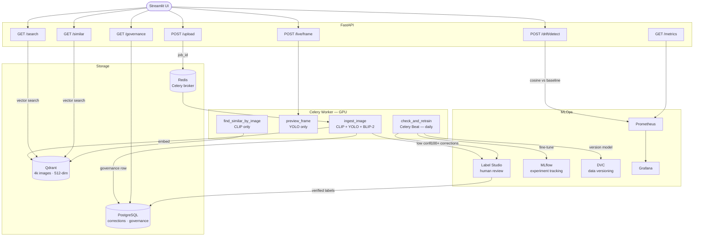

# VisualVault

**Semantic image and video search with a self-healing ML pipeline.**

94% Recall@10 · 3.8× TensorRT speedup · 86% YOLO precision · 88 img/min batch throughput · full MLOps stack

[](https://huggingface.co/spaces/kstha/visualvault-demo)

---

## What it does

VisualVault is a production-grade digital asset management platform. Upload images and videos — three CV models run automatically (CLIP for semantic embedding, YOLO11n for object tagging, BLIP-2 for natural language captioning). Search your entire library in plain English. The system monitors its own embedding drift, flags uncertain detections for human review, and fine-tunes the detection model automatically when enough corrections accumulate.

---

## Measured results

| Metric | Value | Notes |
|---|---|---|
| Recall@10 (CLIP ViT-B/32) | **0.94** | 200 eval queries, 4k indexed images |
| Search latency p95 | **15ms** | Qdrant, top-10, 4k images |
| Indexing throughput | **55 img/s** | CLIP embed + Qdrant upsert |
| Batch ingestion | **88 img/min** | Celery async pipeline, single worker |
| TensorRT speedup | **3.8×** | 0.94ms vs 3.58ms (CLIP image encoder) |
| Video processing | **230× real-time** | FFmpeg keyframe extraction, 0.26s/min |
| YOLO precision (holdout) | **86.1%** | 200 held-out COCO images, class-presence |
| YOLO recall (holdout) | **78.1%** | Same evaluation, confidence ≥ 0.25 |
| YOLO F1 (holdout) | **81.9%** | Harmonic mean |
| OOD drift score | **0.339** | 2.3× above alert threshold of 0.15 |

---

## Architecture



---

## Tech stack

| Layer | Tools |
|---|---|
| ML models | CLIP ViT-B/32, YOLO11n, BLIP-2 OPT-2.7B, TensorRT |
| Search | Qdrant (vector store, 512-dim cosine) |
| Backend | FastAPI, Celery, Redis |
| Database | PostgreSQL (corrections, governance) |
| Frontend | Streamlit (main app + HF Spaces demo) |
| MLOps | MLflow, DVC, Label Studio |
| Monitoring | Prometheus, Grafana |
| Infrastructure | Docker Compose, GitHub Actions CI |

---

## Quick start (local development)

Infrastructure runs in Docker. Python services run locally.

```bash
git clone https://github.com/stharajkiran/VisualVault
cd visualvault
cp .env.example .env

# Start infrastructure
docker compose up -d qdrant redis postgres

# Index 4,000 COCO images
uv run python scripts/data/index_images.py

# Start API
uv run uvicorn app.api.main:app --reload

# Start worker (new terminal)
uv run celery -A app.worker.celery_app.celery_app worker --loglevel=info --pool=solo

# Start UI (new terminal)
uv run streamlit run app/ui/app.py
```

---

## Phases

| Phase | Status | Key deliverables |
|---|---|---|
| 1 — Semantic Search Engine | ✅ | CLIP + Qdrant search, 0.94 Recall@10, HF Spaces demo |
| 2 — Production Pipeline | ✅ | Celery async, TensorRT 3.8×, Prometheus + Grafana, GitHub Actions CI |
| 3 — Self-Healing System | ✅ | Drift detection, Label Studio active learning, automated YOLO retraining |
| 4 — Enterprise Platform | 🔄 | Governance, real-time ingest, find similar, impact metrics |
